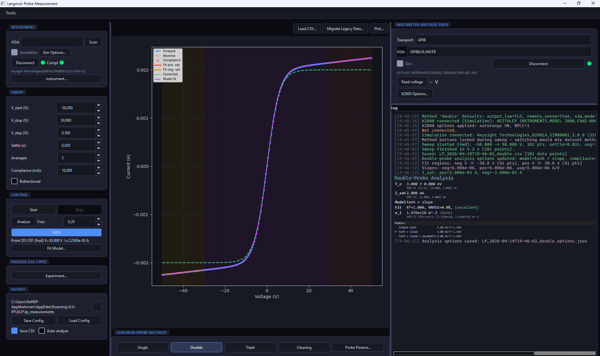

# Langmuir Probe Measurement

Langmuir Probe Measurement is a Windows desktop application for
Langmuir-probe plasma diagnostics in a laboratory environment. It is
designed for use with a Keysight **B2901 / B2910BL** SMU and a
**Keithley 2000** multimeter.

The software is written in Python 3.13 with PySide6, packaged with
PyInstaller, and distributed as a single **Inno Setup** installer.

---

## Overview

The application supports the full measurement and analysis workflow for
Langmuir-probe diagnostics on a bench-top setup. It enables laboratory
operators to:

- run **Single**, **Double**, **Triple**, and **Cleaning** workflows,
- acquire I–V sweeps from the SMU,
- read reference voltages from the Keithley 2000,
- analyse the data through a transparent fitting pipeline,
- save results as versioned CSV files with per-analysis JSON sidecars,
- inspect **explicit fit-status reporting**, **95 % confidence
  intervals** for T<sub>e</sub>, I<sub>sat</sub>, and n<sub>i</sub>
  (fit-only), and
- diagnose **classified VISA errors** with practical remediation hints.

The application runs fully offline on a laboratory PC and has no cloud
dependencies.



## Measurement modes

| Mode | Primary output | Typical use |
|------|----------------|-------------|
| Single | T<sub>e</sub>, V<sub>f</sub>, V<sub>p</sub>, n<sub>e</sub> | Grounded plasmas with a usable wall reference |
| Double | T<sub>e</sub>, I<sub>sat</sub>, n<sub>i</sub> | RF, magnetised, or floating-reference plasmas |
| Triple | T<sub>e</sub>, n<sub>e</sub> (live) | Fast transients and live monitoring |
| Cleaning | — | In-situ reconditioning of the probe tip |

## Hardware setup

The software is intended for the following hardware environment:

- **Keysight B2901A/B or B2910BL** source-measure unit
  (voltage source and current measurement),
- **Keithley 2000** 6.5-digit digital multimeter for reference-voltage
  readout,
- **GPIB-USB adapter** such as the Keysight 82357B or NI GPIB-USB-HS,
  and/or an RS232 connection for the Keithley 2000,
- a physical probe head with the corresponding matched cables for
  **Single**, **Double**, or **Triple** operation.

## Quick start

### Run from a source checkout

```bat
python -m pip install -U pip
python -m pip install numpy scipy pandas matplotlib PySide6 pyvisa pyserial pyfiglet colorama pyinstaller

rem start the application from source
python LPmeasurement.py

rem run the test suite
pytest

rem build the installer
build.bat
```

The `build.bat` script performs a pre-build environment check, runs
PyInstaller, and, if Inno Setup 6 is installed, compiles the installer.
The resulting installer is written to:

```text
installer_output\LangmuirMeasure_v3.0_setup.exe
```

## Runtime prerequisites

The target PC should provide the following components:

1. **Microsoft Visual C++ 2015–2022 x64 runtime** (`vc_redist.x64.exe`)
   — typically already present on Windows 10 or Windows 11. If staged
   next to the `.iss` file, the installer can chain it silently.
2. **A system VISA library** — either *Keysight IO Libraries Suite*
   (recommended) or *NI-VISA*. This installs `visa32.dll` / `visa64.dll`
   and the GPIB driver required by the USB adapter. The installer warns
   if neither library is detected.
3. **A USB-to-RS232 adapter driver** (for example FTDI or Prolific) —
   required only if the Keithley 2000 is connected through a USB serial
   converter.

For the complete installation checklist, see
[`docs/INSTALL_prereqs.md`](docs/INSTALL_prereqs.md).

## Launching the software

- From source: `python LPmeasurement.py`
- From an installed build: `LangmuirMeasure.exe`
  (available through the Start menu shortcut)

## Repository layout

```text
LPmeasurement.py                  main window and method dispatcher
dlp_*.py                          analysis routines and option dialogs
keysight_b2901.py / keithley_2000.py  instrument drivers
fake_b2901*.py / fake_keithley_2000.py  simulated instruments for tests
visa_errors.py                    VISA error classification
interface_discovery.py            Tools → Interface Discovery window
visa_persistence.py               cache for last-used resources
analysis_options_sidecar.py       per-analysis JSON sidecar
dlp_csv_schema.py                 versioned CSV banner
LangmuirMeasure.spec              PyInstaller spec (REQUIRED_LOCAL)
LangmuirMeasure_setup.iss         Inno Setup script
build.bat                         one-step build driver
tools/check_langmuir_build_env.py pre-build import sanity check
tests/                            ~1000-test pytest suite
docs/                             user manual and installation checklist
```

## Status and scope

Current release: **v3.0**, centred on `LPmeasurement.py`.

The **Single**, **Double**, and **Triple** analysis paths are considered
production-grade and include explicit reporting for status,
uncertainty, and compliance. Known limitations and planned future work
are documented in the
[developer handbook](docs/LangmuirMeasure_Documentation.md)
(Section D.8).

The legacy V2 standalone window is still shipped as shared widget code
for LP, but it is no longer the primary user-facing workflow.

## Documentation

- **End-user manual (bilingual EN + DE):**
  [`docs/LangmuirMeasure_Documentation.docx`](docs/LangmuirMeasure_Documentation.docx)
  
  Outline version:
  [`docs/LangmuirMeasure_Documentation.md`](docs/LangmuirMeasure_Documentation.md)
- **Prerequisite checklist:**
  [`docs/INSTALL_prereqs.md`](docs/INSTALL_prereqs.md)
- **In-app help:** available through the **Help** buttons in the
  **Single** and **Double** options dialogs

## License and contact

Internal project of the I. Physikalisches Institut, JLU Giessen.
Issues, feature requests, and patches should be handled through the
repository’s issue tracker.
